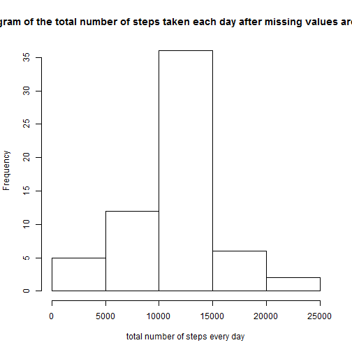

---
title: "PA1_template"
author: "may"
date: "2017-12-31"
output: html_document
editor_options: 
chunk_output_type: console
---


## 1.Code for reading in the dataset and/or processing the data

```r
d= read.csv(unz("activity.zip","activity.csv"),head=T,na.strings = 'NA')
```

## 2.Histogram of the total number of steps taken each day  

```r
if (require("dplyr")==FALSE){
    install.packages("dplyr")
    library(dplyr)
}
```


```r
d_g=group_by(d,date)
s=summarise(d_g,total_steps=sum(steps,na.rm = T))
hist(s$total_steps,main = "Histogram of the total number of steps taken each day",
     xlab = "total number of steps every day")
```


## 3.Mean and median number of steps taken each day

```r
mean=mean(s$total_steps)
median=median(s$total_steps)
```
mean is **9354.2295082** and median is **10395**

## 4.Time series plot of the average number of steps taken

```r
d_g=group_by(d,interval)
avg_steps=summarise(d_g,avg=mean(steps,na.rm=T))
plot(avg_steps$interval,avg_steps$avg,type="l",main = "Time series plot of the average number of steps taken")
abline(v=avg_steps[which.max(avg_steps$avg),1])
```


## 5.The 5-minute interval that, on average, contains the maximum number of steps 

```r
maximum=avg_steps[which.max(avg_steps$avg),1]
```
The 5-minute interval that, on average, contains the maximum number of steps 
is **835**

## 6.Code to describe and show a strategy for imputing missing data

```r
sum(is.na(d$steps))
```

```
## [1] 2304
```

```r
d_impute=d

# fill the NAs by the average steps of the same 5-minute
for(i in 1:nrow(d_impute))
{
    if (is.na(d_impute[i,"steps"])) {
        d_impute[i,"steps"]=
            avg_steps[which(avg_steps$interval==d_impute[i,"interval"]),"avg"]
    }
}
```

## 7.Histogram of the total number of steps taken each day after missing values are imputed

```r
d_impute_g=group_by(d_impute,date)
s_impute=summarise(d_impute_g,total_steps=sum(steps,na.rm = T))
hist(s_impute$total_steps,main = "Histogram of the total number of steps taken each day after missing values are imputed",
     xlab = "total number of steps every day")
```



```r
mean_impute=mean(s_impute$total_steps)
median_impute=median(s_impute$total_steps)
```
the mean and median total number of steps taken per day is **10766** and **10766**. the impact of imputing missing data on the estimates of the total daily number of steps is that the Frequency of 0-5000 steps become much less. 


## 8.Panel plot comparing the average number of steps taken per 5-minute 
interval across weekdays and weekends

```r
# install 'chron' to call 'is.weekend'
if (require("chron")==FALSE){
    install.packages("chron")
    library(chron)
}
```


```r
# create a variable "weekday"
d_impute$date = as.Date(d_impute$date)
w=function(x) {
    if(is.weekend(x)){
        "weekend"
    } else
    {
        "weekday"
    }
}
d_impute$weekday = sapply(d_impute$date,FUN = w)
d_impute$weekday = as.factor(d_impute$weekday)

# summrise
d_impute_g = group_by(d_impute,weekday,interval)
s=summarise(d_impute_g,numberofsteps=mean(steps))
```


```r
# install 'chron' to call 'is.weekend'
if (require("lattice")==FALSE){
    install.packages("lattice")
    library(lattice)
}
```

plot

```r
xyplot(numberofsteps ~ interval | weekday,data = s, layout = c(1,2),type="l",
       main='comparing the average number of steps taken per 5-minute interval across weekdays and weekends')
```


